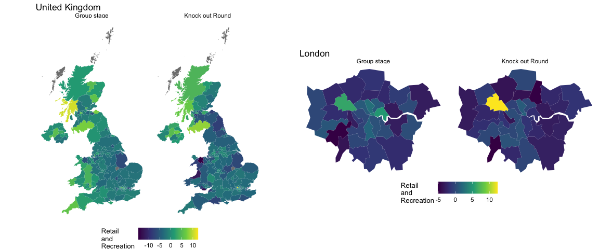
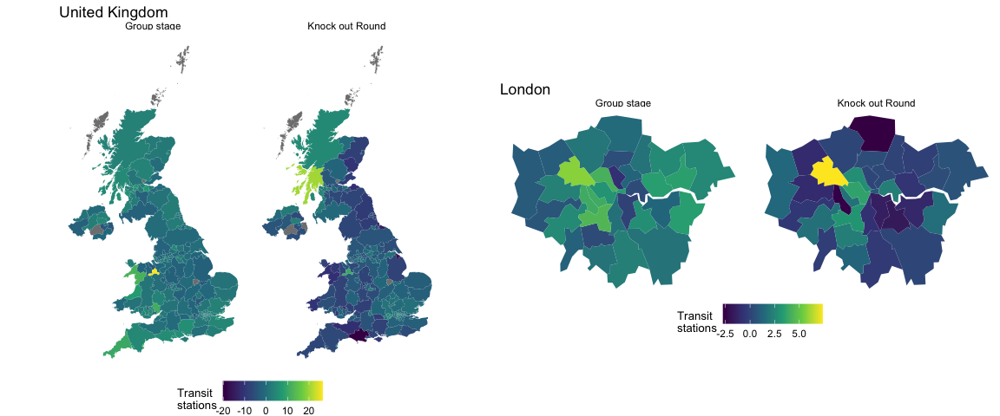
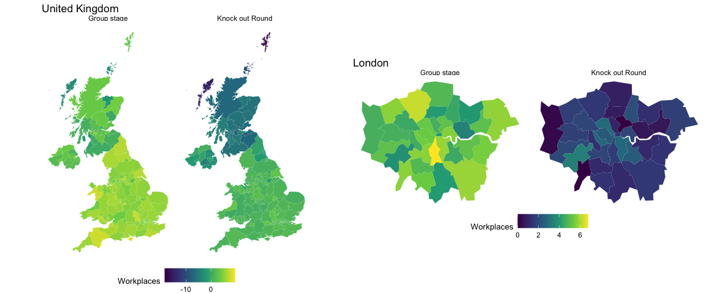

Changes in UK mobility on EURO 2020 match days
================
Amber Barton
06/07/2021

## Rationale

To find the extent to which concerns that crowds of fans celebrating
EURO 2020 will facilitate spread of the SARS-CoV-2 variant are founded.

## Results

**Retail and recreation**

Mobility for retail and recreation was markedly increased in certain
areas of Scotland and Northern Ireland, and as would be expected, in
Brent, the London Borough containing Wembley.

<!-- -->

**Transit stations**

Mobility through transit stations was increased in certain areas of
Scotland, in Brent and in Wrexham.

<!-- -->

**Work place**

While England saw an increase in mobility to the work place, this was
less the case in Scotland.

<!-- -->

## Method

1.  Downloaded Google Community Mobility Reports up to June
2.  Identified UK-based Euro Match Days
3.  Normalised each to mobility on the previous 4 days of the same
    weekday
4.  Took the mean of the normalised change in mobility for the match
    days
5.  Merged with county boundary data from Open Geography Portal

## Caveats

-   Data is not available for July, where any effects would be more
    marked due to semi-finals and finals in Wembley

-   Data provided was in the format of “percentage change from
    baseline”, without providing baseline mobility figures

-   Counties with lower populations could be more subject to random
    fluctuations in mobility
